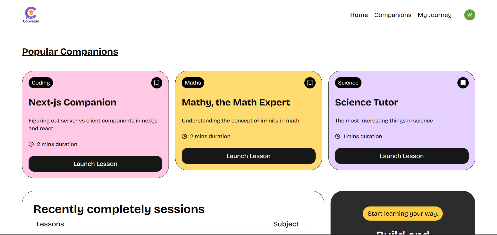

# Converso - AI-Powered Voice Study Companions

Converso is a modern AI-powered platform designed to help users learn various subjects through interactive, voice-based study companions. Built with Next.js 15, it leverages Vapi.ai for seamless voice interactions, Clerk for secure authentication, and Supabase for reliable data storage.



## 🚀 Features

- **Voice-Based Interaction**: Real-time voice conversations with AI study companions using Vapi.ai.
- **Custom Companions**: Create and customize your own study companions with specific subjects, topics, and voice styles.
- **Subject-Specific Learning**: Specialized companions for Maths, Language, Science, History, Coding, and Economics.
- **Session History**: Track your progress with a detailed history of your study sessions.
- **Bookmarks**: Save your favorite companions for quick access.
- **Secure Authentication**: Robust user management and route protection via Clerk.
- **Modern UI**: A responsive and accessible interface built with Tailwind CSS and Radix UI.

## 🛠️ Tech Stack

- **Framework**: [Next.js 15 (App Router)](https://nextjs.org/)
- **Language**: [TypeScript](https://www.typescriptlang.org/)
- **Authentication**: [Clerk](https://clerk.com/)
- **Database**: [Supabase](https://supabase.com/)
- **Voice SDK**: [Vapi.ai](https://vapi.ai/)
- **Styling**: [Tailwind CSS](https://tailwindcss.com/)
- **Components**: [Radix UI](https://www.radix-ui.com/)
- **Form Management**: [React Hook Form](https://react-hook-form.com/) & [Zod](https://zod.dev/)
- **Monitoring**: [Sentry](https://sentry.io/)

## 📂 Project Structure

```text
converso/
├── app/                  # Next.js App Router routes and pages
│   ├── api/              # API routes (Sentry examples)
│   ├── companions/       # Companion management and interaction pages
│   ├── sign-in/          # Custom Clerk sign-in pages
│   └── layout.tsx        # Global layout and providers
├── components/           # Reusable UI components
│   └── ui/               # Radix UI primitives and base components
├── constants/            # Static constants and configuration
├── lib/                  # Utility functions and external SDK clients
│   ├── actions/          # Server actions for database operations
│   └── supabase.ts       # Supabase client configuration
├── public/               # Static assets (images, icons)
├── types/                # TypeScript type definitions
└── package.json          # Project dependencies and scripts
```

## ⚙️ Getting Started

### Prerequisites

- Node.js 20+ 
- npm / yarn / pnpm / bun
- A [Clerk](https://clerk.com/) account
- A [Supabase](https://supabase.com/) project
- A [Vapi.ai](https://vapi.ai/) account

### Installation

1. Clone the repository:
   ```bash
   git clone https://github.com/your-username/converso.git
   cd converso
   ```

2. Install dependencies:
   ```bash
   npm install
   ```

3. Set up environment variables:
   Create a `.env.local` file in the root directory and add the following:
   ```bash
   # Clerk Authentication
   NEXT_PUBLIC_CLERK_PUBLISHABLE_KEY=your_clerk_publishable_key
   CLERK_SECRET_KEY=your_clerk_secret_key
   NEXT_PUBLIC_CLERK_SIGN_IN_URL=/sign-in

   # Supabase Configuration
   NEXT_PUBLIC_SUPABASE_URL=your_supabase_url
   NEXT_PUBLIC_SUPABASE_ANON_KEY=your_supabase_anon_key

   # Vapi.ai Configuration
   NEXT_PUBLIC_VAPI_WEB_TOKEN=your_vapi_web_token

   # Sentry (Optional)
   SENTRY_AUTH_TOKEN=your_sentry_auth_token
   ```

### Running the Project

Run the development server:

```bash
npm run dev
```

Open [http://localhost:3000](http://localhost:3000) with your browser to see the result.

## 📜 Available Scripts

- `npm run dev`: Starts the development server with Turbopack.
- `npm run build`: Builds the application for production.
- `npm run start`: Starts the production server.
- `npm run lint`: Runs ESLint to check for code quality issues.

## ✅ TODOs / Future Enhancements

- [ ] Implement comprehensive unit and integration tests.
- [ ] Add more voice styles and languages.
- [ ] Implement user profiles and progress tracking dashboard.
- [ ] Add support for file uploads/documents for companion context.

---

Built with ❤️ by [Your Name/Organization]
